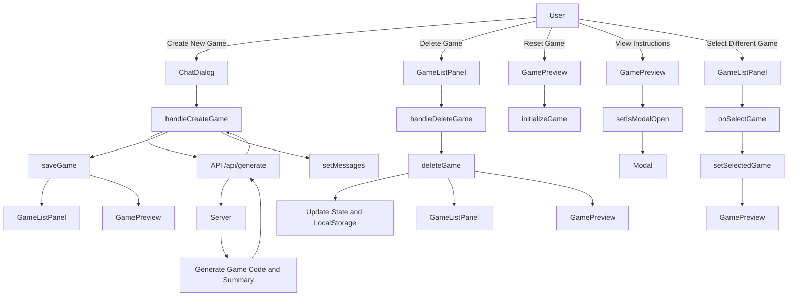

```mermaid
graph TD
    A[User] -->|Create New Game| B[ChatDialog]
    B --> C[handleCreateGame]
    C --> D[API /api/generate]
    D --> E[Server]
    E --> F[Generate Game Code and Summary]
    F --> D
    D --> C
    C --> G[saveGame]
    G --> H[GameListPanel]
    G --> I[GamePreview]
    C --> J[setMessages]

    A -->|Delete Game| K[GameListPanel]
    K --> L[handleDeleteGame]
    L --> M[deleteGame]
    M --> N[Update State and LocalStorage]
    M --> O[GameListPanel]
    M --> P[GamePreview]

    A -->|Reset Game| Q[GamePreview]
    Q --> R[initializeGame]

    A -->|View Instructions| S[GamePreview]
    S --> T[setIsModalOpen]
    T --> U[Modal]

    A -->|Select Different Game| V[GameListPanel]
    V --> W[onSelectGame]
    W --> X[setSelectedGame]
    X --> Y[GamePreview]
```