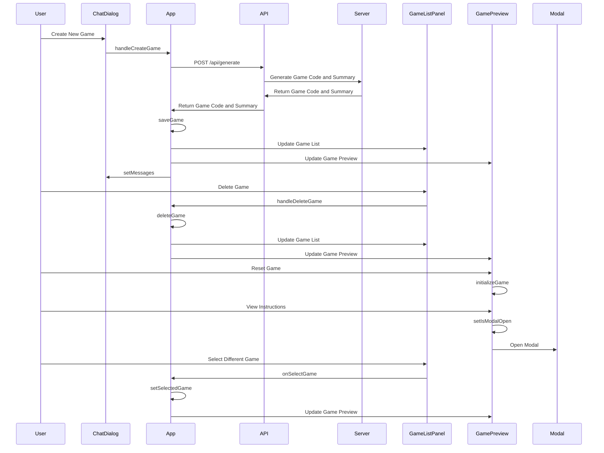

```mermaid
sequenceDiagram
    participant User
    participant ChatDialog
    participant App
    participant API
    participant Server
    participant GameListPanel
    participant GamePreview
    participant Modal

    User ->> ChatDialog: Create New Game
    ChatDialog ->> App: handleCreateGame
    App ->> API: POST /api/generate
    API ->> Server: Generate Game Code and Summary
    Server ->> API: Return Game Code and Summary
    API ->> App: Return Game Code and Summary
    App ->> App: saveGame
    App ->> GameListPanel: Update Game List
    App ->> GamePreview: Update Game Preview
    App ->> ChatDialog: setMessages

    User ->> GameListPanel: Delete Game
    GameListPanel ->> App: handleDeleteGame
    App ->> App: deleteGame
    App ->> GameListPanel: Update Game List
    App ->> GamePreview: Update Game Preview

    User ->> GamePreview: Reset Game
    GamePreview ->> GamePreview: initializeGame

    User ->> GamePreview: View Instructions
    GamePreview ->> GamePreview: setIsModalOpen
    GamePreview ->> Modal: Open Modal

    User ->> GameListPanel: Select Different Game
    GameListPanel ->> App: onSelectGame
    App ->> App: setSelectedGame
    App ->> GamePreview: Update Game Preview
```